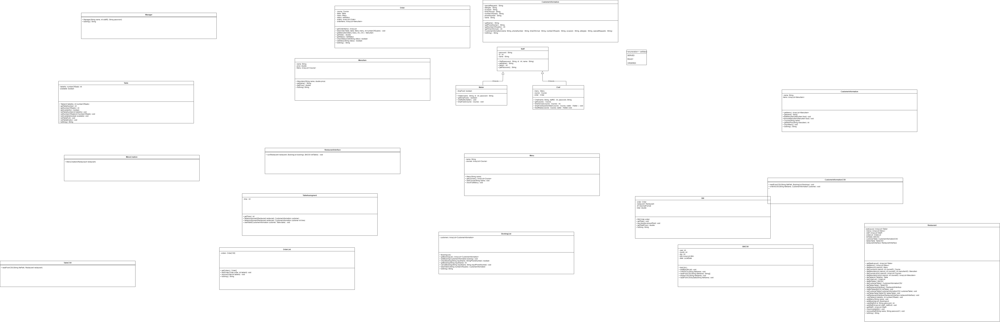
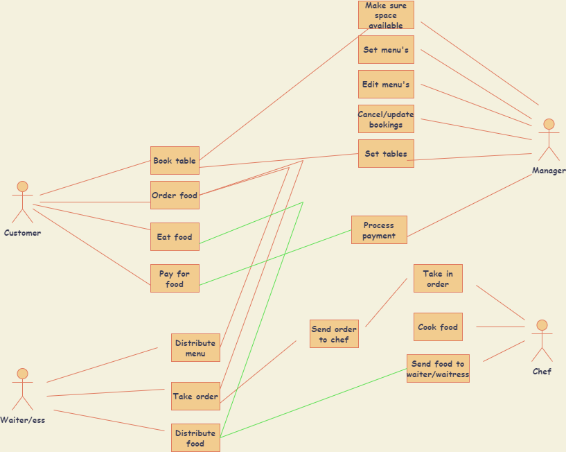
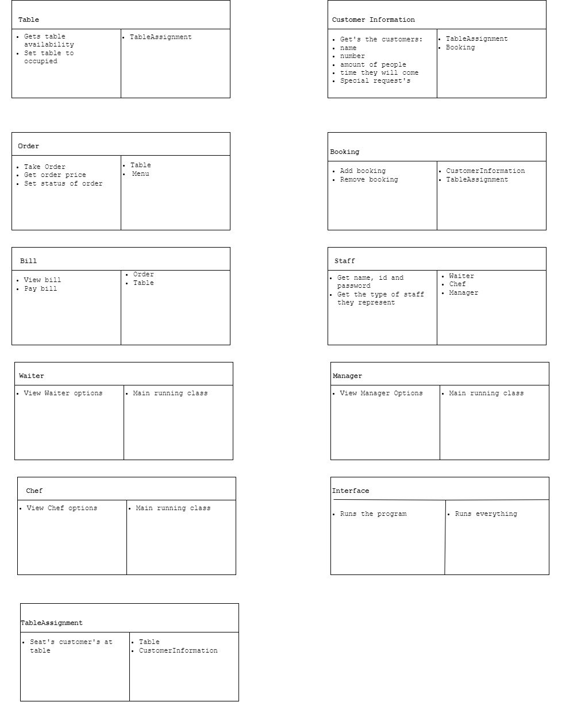

# CS4013 Group Project
## Team Members:
1. Olan Healy:    21318204
2. Kevin Collins: 21344256
3. Mohammad Islam 21304599
4. Sean Capilis:  21342342

----------------------------------------------
## System Requirements
There are many requirements when managing a restaurant chain. Some ones we will look at are:
1. They will need to be able to manage how many free tables there are at a time they are available at.
2. They will need be able to manage how to take in the details of each customer to notify them about the availability of their booking.
3. They will need to be able to take in the orders from the customers and deliver them to the kitchen staff.
4. They will need to be able to supply a menu for the customer, so they can pick what they want to eat.
5. They will need to keep track of how much each table needs to pay for the food they consume.
6. They will need to have a cancellation system for their customers if they can no longer attend.
7. They will need to have a system so as they customers can pay by cash or card.
8. They will need to have a system which keeps track of reservations in case any walk in customers can be seated
------------------------------------------------
## UML Diagram

------------------------------------------------
## Use case 

The four main actors in our system are the Manager, Customer, Waiter/ess and the Chef.
__Manager:__ Mainly responsible for taking in table bookings and setting the menu items.
__Customer:__ Mainly responsible for making a table booking, using the menu to pay for the food and eating the food.
__Waiter/ess:__ Mainly responsible for distributing the menus, taking food orders, sending orders to chef and distributing
orders to the customers.
__Chef:__ Mainly responsible for cooking the food ordered by the customers.

 Some of the main components of the use case are:
1. __Cancel/update bookings:__ Making sure bookings are cancelled if requested and updating availability. 
2. __Set Tables:__ Make sure the correct number of seats for required customers are there.
3. __Book table:__ Add in a table booking.
4. __Order food:__ Customer orders food and order is sent to Chef via waiter/ess.
5. __Pay for food:__ Customer pays for the food they consumed on their table.

------------------------------------------------
## CRC diagrams

------------------------------------------------
## Activity Diagrams
1. PLACE ORDER: steps required to place an order in the restaurant
   

2. TABLE RESERVATION: Manger performs activity to process reservation made by customer
   
