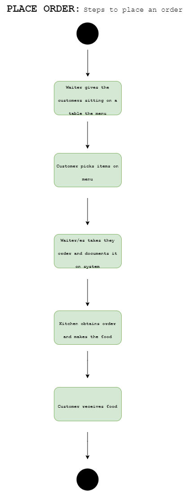
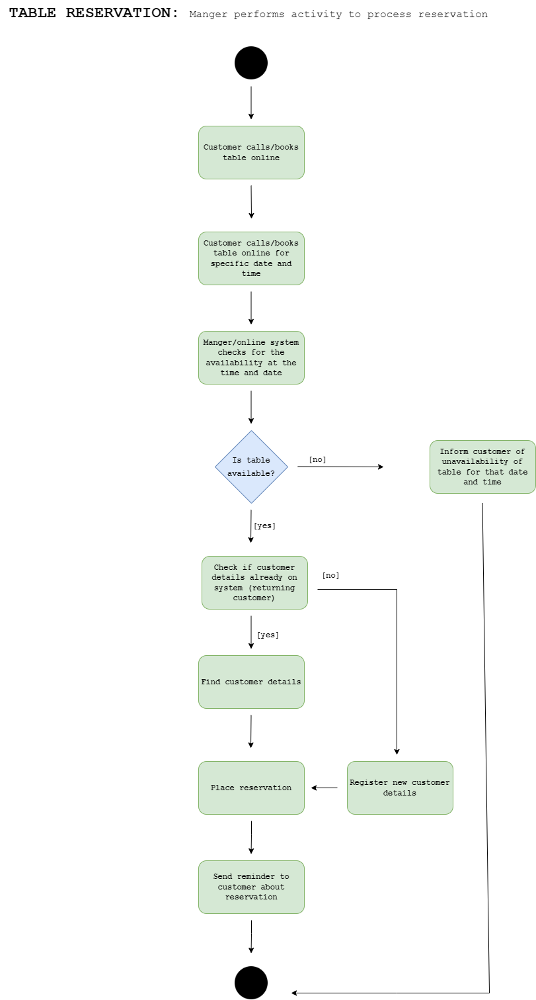

# CS4013 Group Project
## Team Members:
1. Olan Healy:    21318204
2. Kevin Collins: 21344256
3. Adam Clarke:   20228805
4. Sean Capilis:  21342342

----------------------------------------------
## System Requirements
There are many requirements when managing a restaurant chain. Some ones we will look at are:
1. They will need to be able to manage how many free tables there are on specific dates/ the time they are available at.
2. They will need be able to manage how to take in the details of each customer to notify them about the availability of their booking.
3. They will need to be able to take in the orders from the customers and deliver them to the kitchen staff.
4. They will need to be able to supply a menu for the customer, so they can pick what they want to eat.
5. They will need to keep track of how much each table needs to pay for the food they consume.
6. They will need to have a cancellation system for their customers if they can no longer attend.
7. They will need to have a waiting list for customer who wish to take up any available cancellations.
8. They will need to have a system so as they customers can pay by cash or card.
9. They will need to have a system which keeps track of reservations in case any walk in customers can be seated

------------------------------------------------
## CRC diagrams

.png)
------------------------------------------------
## Activity Diagrams
1. PLACE ORDER: steps required to place an order in the restaurant
   
2. TABLE RESERVATION: Manger performs activity to process reservation made by customer
   
